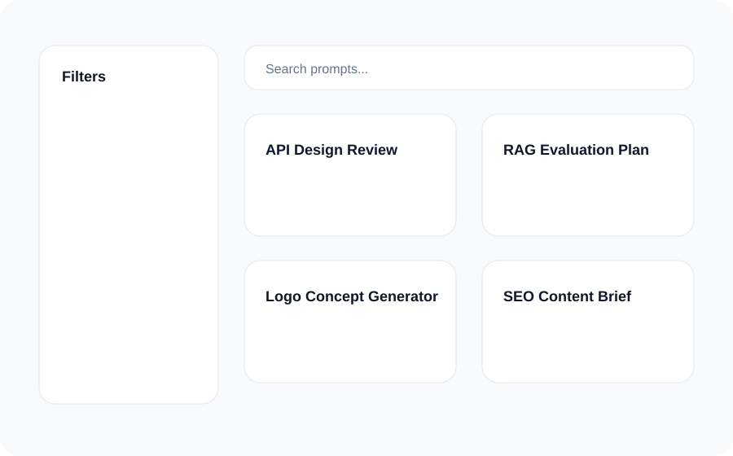
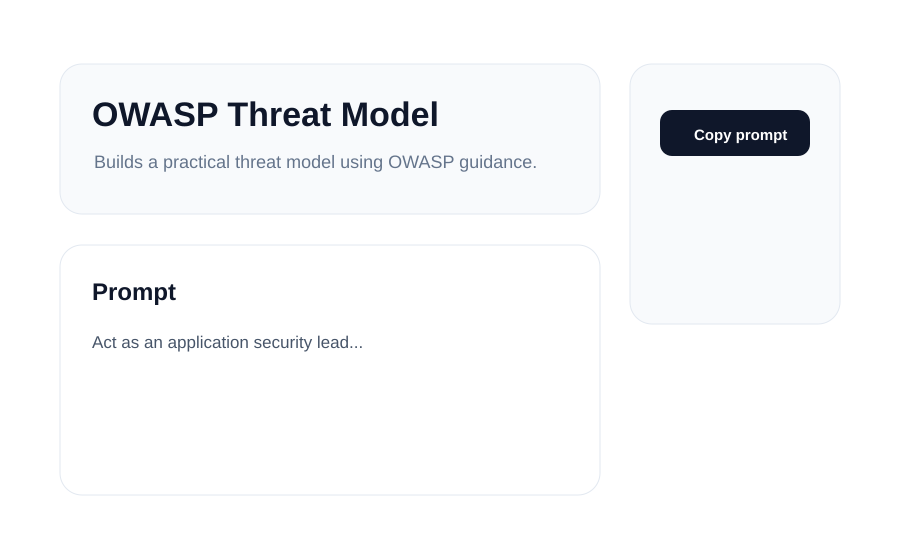

<p align="center">
  
</p>

<h1 align="center">Prompt Empir</h1>

<p align="center">
  Professional AI Prompt Library — curated prompts for developers, designers, creators, businesses, students, marketers, and researchers.
</p>

<p align="center">
  <a href="LICENSE"></a>
  
  
  
</p>

Prompt Empir is an open-source, production-ready prompt library and website built for professionals who want reusable, high-quality prompts across major AI platforms and industries.

> Name is configurable in `website/src/lib/config.ts`.

## Features

- Browse prompts by category and subcategory.
- Instant full-text search powered by Fuse.js.
- Filter by AI model/platform.
- One-click copy button on prompt pages.
- Markdown-first prompt format for GitHub readability.
- Contribution workflow via pull requests.
- Dark, light, and system theme support.
- SEO metadata, Open Graph, sitemap, and robots.txt.
- Secure markdown rendering with sanitization.
- Repository links for GitHub issues and pull requests.

## Supported AI Platforms

**General AI:** ChatGPT, Claude, Gemini, Grok, DeepSeek, Perplexity  
**Coding AI:** Cursor, GitHub Copilot, Windsurf, Replit AI, Bolt, Lovable  
**Image AI:** Midjourney, DALL-E, Flux, Stable Diffusion, Leonardo AI  
**Video AI:** Veo, Runway, Kling  
**Audio AI:** ElevenLabs, Suno, Udio

## Categories

Development, Design, Business, Writing, Education, Productivity, Psychology, Philosophy, Sports, Finance, Career, Social Media, E-commerce, Creative, General AI, Coding AI, Image AI, Video AI, and Audio AI.

## Screenshots

| Homepage | Prompt Explorer | Prompt Page |
|---|---|---|
|  |  |  |

## Repository Structure

```txt
prompt-empir/
├── README.md
├── LICENSE
├── CONTRIBUTING.md
├── CODE_OF_CONDUCT.md
├── SECURITY.md
├── CHANGELOG.md
├── docs/
├── prompts/
└── website/
```

## Installation

```bash
git clone https://github.com/gavuvapro/prompt-empire.git
cd prompt-empir/website
npm install
npm run dev
```

Open <http://localhost:3000>.

## Local Development

```bash
cd website
npm run generate:index
npm run lint
npm run typecheck
npm run build
```

Prompt content lives in `prompts/`. The website index is generated from Markdown files.

## Prompt File Format

Every prompt must follow this format:

```md
# Prompt Title

## Description
Explain what the prompt does.

## Best AI Models
- ChatGPT
- Claude
- Gemini

## Use Cases
- Example 1
- Example 2

## Prompt
[prompt here]

## Example Output
[sample output]
```

## Contributing

We welcome contributions. See [CONTRIBUTING.md](CONTRIBUTING.md).

Quick flow:

1. Fork the repository.
2. Create a branch: `git checkout -b add/my-prompt`.
3. Add a prompt in the correct category.
4. Run `cd website && npm run generate:index`.
5. Submit a pull request.

Please use Conventional Commits, such as `feat(prompts): add API review prompt`.

## Support Prompt Empir

If this repository helps you, consider supporting its development.

<p>
  <a href="https://github.com/gavuvapro/prompt-empire">GitHub Repository</a> ·
  <a href="https://github.com/gavuvapro/prompt-empire/issues">Issues</a> ·
  <a href="https://github.com/gavuvapro/prompt-empire/pulls">Pull Requests</a>
</p>

## License

MIT © Prompt Empir contributors.
